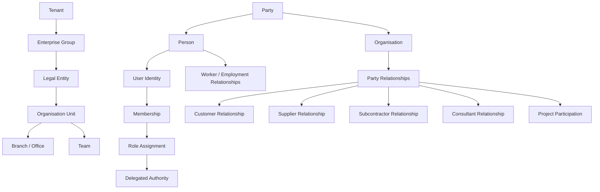
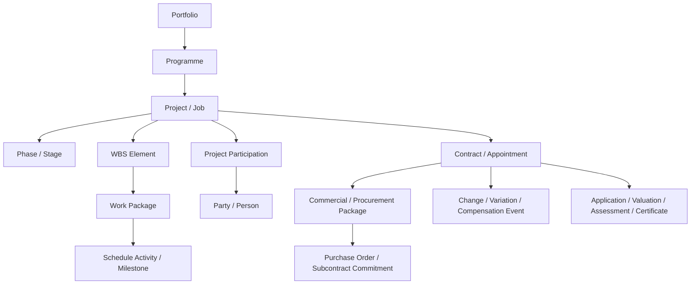
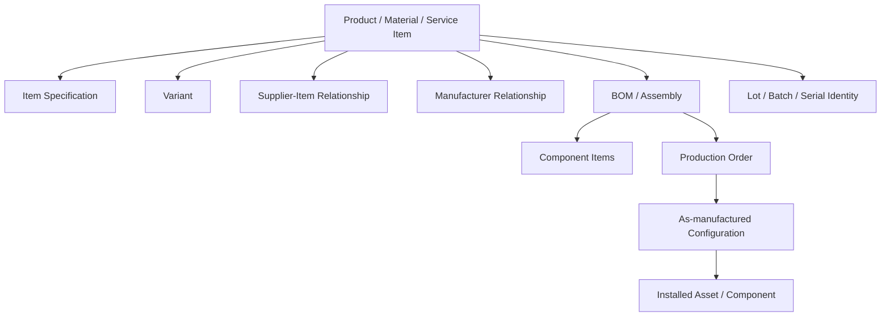
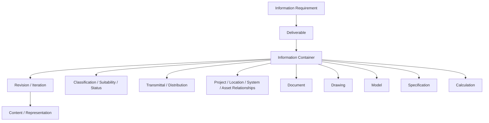
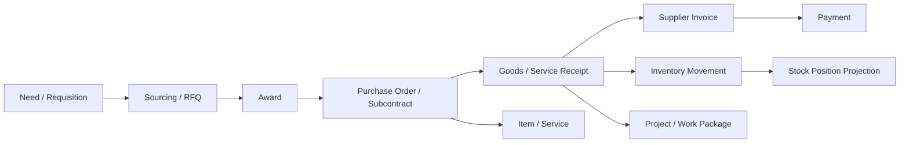
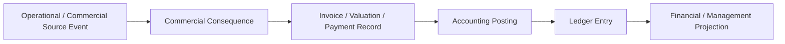
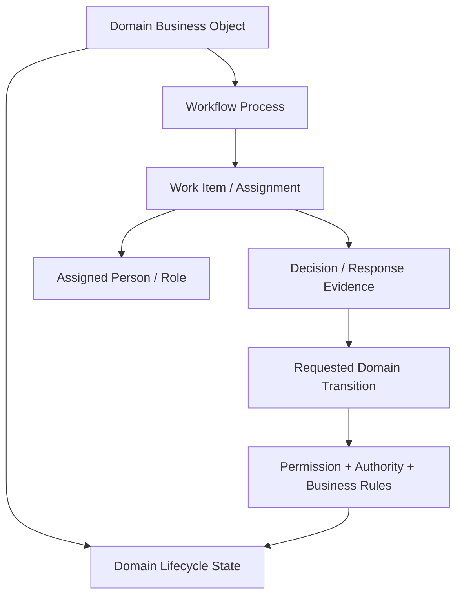
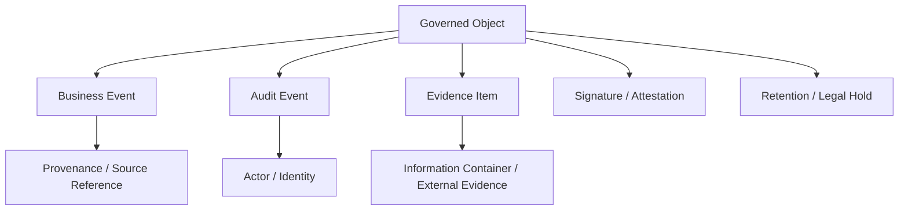

# NuBlox Core Business Object Map

**Status:** design-review baseline  
**Purpose:** show the minimum identity and relationship backbone that the wider Construction & Built Environment object universe must attach to.

This is a conceptual map, not a physical database ERD.

## 1. Enterprise and party identity

The same organisation can hold several relationships simultaneously. Customer, supplier, subcontractor and consultant are not duplicate organisation masters.

## 2. Delivery, project and contract context

Projects, contracts and packages are related but must not be treated as interchangeable scope structures.

## 3. Built-environment spatial and technical identity

```mermaid
graph TD
  EN[Estate / Network] --> SI[Site]
  SI --> LP[Land / Property]
  SI --> FI[Facility / Building / Infrastructure Entity]
  FI --> LOC[Level / Zone / Space / Linear Segment]
  FI --> SYS[System / Subsystem]
  LOC --> AS[Asset / Component / Maintainable Item]
  SYS --> AS

  AS --> AM[Asset Type / Model]
  AS --> WAR[Warranty]
  AS --> MTR[Meter / Sensor / Condition Point]
  AS --> HIST[Operational / Maintenance History]
```

The physical asset identity survives design, procurement, installation, commissioning, handover, operation, maintenance, refurbishment and disposal.

## 4. Product, material and manufactured definition

Product definition and physical asset identity are related but distinct: a product/model describes what can be made or supplied; an asset/serial instance describes what actually exists in the built environment.

## 5. Information and design identity

Review/approval tasks are workflow objects acting on the controlled information; they are not the information container itself.

## 6. Procurement, inventory and delivery thread

Stock position is normally a projection from inventory movements, not a second mutable source of truth.

## 7. Commercial and financial recognition

Commercial and accounting positions must remain traceable to source evidence. Reporting views are projections unless an approved reporting snapshot is explicitly frozen.

## 8. Work, workflow and domain-state separation

This is the key correction from the F01.01 prototype: workflow coordinates human work, but the domain object owns its business state and validates the transition.

## 9. Evidence and audit backbone

Evidence links to domain truth; it does not replace structured business state.

## 10. Review principle

Every candidate business object in the generated register must ultimately attach to this backbone or justify a new identity pattern.

If a proposed object cannot answer **what gives it independent identity, what scope owns it, what it relates to, and why it cannot be a relationship/event/version/projection of another object**, it should not be promoted to canonical root status.
